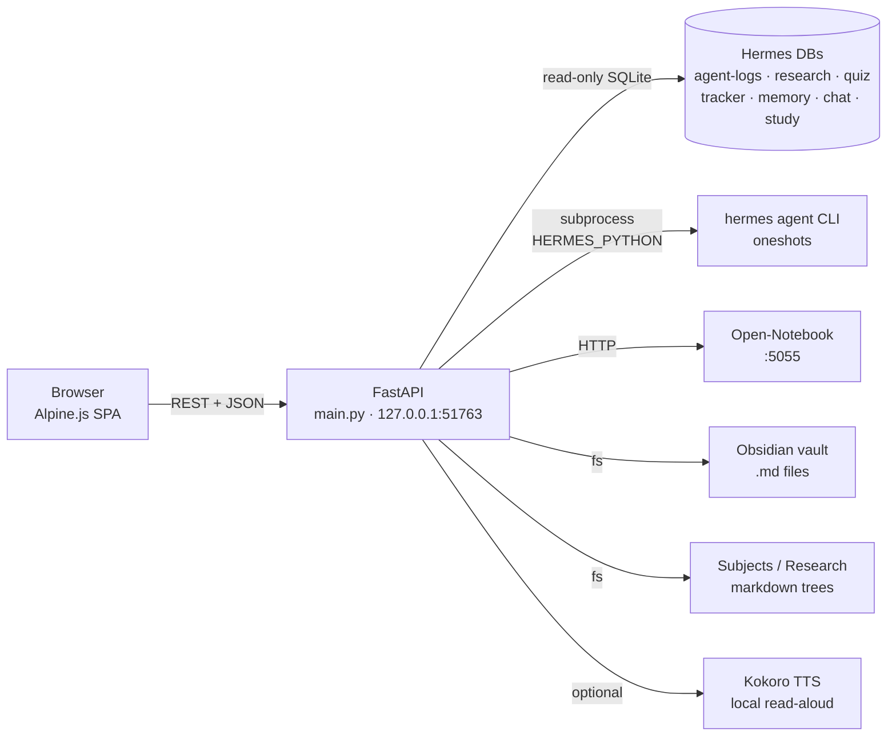

# Mission Control

> A self-hosted study command center — one dark, fast web UI on top of a personal
> agent stack. Briefing, library, research, practice, planner, memory, obsidian,
> terminal, all rendered on a single OLED-lime design system.


Mission Control is the front-end I run for my own daily study workflow. It is a
single-page Alpine.js app served by a tiny FastAPI backend, surfacing data from
a self-hosted install of [Hermes](https://github.com) (an open-source agent
framework) plus a few local services (an Obsidian vault, an Open-Notebook-style
RAG service, optional local TTS). Every external path, address, and data source
is read from environment variables, so the same code runs on any machine
pointed at any Hermes install.

This repo is the **web UI + its packaging**. It does not include the agent
runtime — that lives in the Hermes project. The dashboard talks to it.

---

## Highlights

- **29 tabs, one shell.** Five top-level groups (Workspace / Study / Plan /
  Knowledge / System) with a pill-nav and per-group subnav. No framework — just
  Alpine.js, vanilla CSS, and vendored libraries.
- **"Volt · OLED Lime" design system.** Lime `#c8ff00` on true `#000`, hatch +
  stipple textures, a single fully-lime focal card per view, jewel-tone
  companions with semantic roles. Tokens live in `static/style.css`; component
  reference at `/design-reference`.
- **Config over code.** `config.py` resolves every path, DB, and bind address
  from env vars — defaults mirror the author's machine, so a clone works as-is,
  and a `.env` lets anyone else point it at their own install.
- **Decoupled from Hermes' venv.** The server runs from its own venv
  (`requirements.txt`, four packages); agent oneshots shell out to
  `$HERMES_PYTHON`. A `hermes update` that rebuilds Hermes' venv can't break
  the server.
- **Degrades gracefully.** With no Hermes install present, the server still
  starts and data-backed tabs render empty states instead of 500s.
- **Lives alongside an upstream framework.** `hermes-customizations/` ships
  sanitized copies of the scripts I use to keep my local Hermes customizations
  alive across `hermes update` — see that folder's README.

## Architecture



**Stack:** Python 3.11 · FastAPI · `uvicorn[standard]` · `aiofiles` · `httpx` ·
SQLite (read-only) · Alpine.js 3 · vanilla CSS · ApexCharts · Observable Plot ·
d3 · Cytoscape · PDF.js · Mermaid · Markmap · xterm.js — all vendored.

A longer write-up is in [`docs/ARCHITECTURE.md`](docs/ARCHITECTURE.md).

## Tab index

The shell renders 29 pages across five groups. Tabs marked *(needs Hermes)*
read from a Hermes install's SQLite DBs; without one they show empty states.

| Group | Page | What it does |
|---|---|---|
| Workspace | Briefing | Auto-composed daily summary *(needs Hermes)* |
| Workspace | Overview | Mission status — totals, agent breakdown, heatmap, calendar |
| Workspace | Agents | Agent roster, recent activity, success-rate strip |
| Workspace | Chat | Multi-agent chat with slash-commands and `@`-mentions |
| Study | Upload | PDF / paste-text intake — pipeline to Scholar / Quizmaster / Planner |
| Study | Library · Notes | Browse Markdown notes by subject |
| Study | Library · Lecture Notes | Time-stamped lecture breakdowns + PDF.js viewer |
| Study | Practice · Quiz | MCQ practice with explanations + weak-spot tracking |
| Study | Practice · Flashcards | SM-2 spaced repetition |
| Study | Recall | Quick last-touched recall over the note vault |
| Plan | Tracker · Today | Daily plan generated from a roadmap spec |
| Plan | Tracker · Roadmap | Phase / week / day plan view |
| Plan | Tracker · Stats | Adherence rings + per-subject readiness |
| Plan | Planner · Schedule | Weekly schedule, deadlines, exams |
| Plan | Planner · Tasks | Kanban — To Do / In Progress / Done |
| Plan | Planner · Focus | Pomodoro + sticky notes |
| Knowledge | NotebookLM · Research | Web research runs with cited findings |
| Knowledge | NotebookLM · Notebooks | Open-Notebook integration *(local :5055 service)* |
| Knowledge | NotebookLM · Chat | RAG Q&A across notebooks |
| Knowledge | NotebookLM · Studio | Notebook artifacts (briefings, mindmaps) |
| Knowledge | Obsidian · Vault | Read-only browser for an Obsidian vault |
| Knowledge | Obsidian · Brain | Cytoscape force-graph of the vault |
| Knowledge | Obsidian · Search | Substring search across `.md` files |
| Knowledge | Memory | Long-term memory store *(needs Hermes)* |
| System | System | Service health board — DBs, processes, disk |
| System | Stats | Observable-Plot stats over agent / study activity |
| System | Knowledge Graph | Cytoscape graph of the codebase (from `codegraph`) |
| System | Terminal | In-browser xterm.js bound to a local shell |
| System | Design Reference | Live spec for the Volt design system |

## Tracker / roadmap

`tracker.py` and `roadmap_spec.py` build a phase → week → day study plan and
expose it as the **Plan · Tracker** tabs. The spec is a small dict-of-dicts
describing exam dates, phases, batch windows, tests, and per-phase tasks; the
generator computes daily blocks from that.

The repo ships a generic **sample** roadmap (exam in 2027, 4 phases:
"warm-up / build / sprint / finals") so the UI lights up out of the box without
revealing the author's plan. If you keep a personal roadmap, drop it next to
`roadmap_spec.py` as `roadmap_private.py` (gitignored, see `.gitignore`) and it
will override the sample at import time. `roadmap.sample.json` is a generated
artifact of the sample for inspection.

## Getting started

**Prerequisites:** Python 3.11+. For full functionality, a Hermes install at
`$HOME/.hermes` (the dashboard reads its SQLite DBs and shells out to its CLI).
Without one, the server still runs — data-backed tabs just show empty states.

```bash
git clone https://github.com/Dhairya2289/mission-control-dashboard.git
cd mission-control-dashboard
./install.sh                              # builds .venv, installs deps, copies .env.example -> .env
. .venv/bin/activate
uvicorn main:app --host 127.0.0.1 --port 51763
# open http://127.0.0.1:51763/
```

To run it as a background service, copy `mission-control.service.example` to
`~/.config/systemd/user/mission-control.service`, edit the two `REPLACE_WITH_*`
paths, and `systemctl --user enable --now mission-control`.

## Configuration

Every path, DB, and bind address comes from the environment. Copy
`.env.example` to `.env`. The defaults work as-is for the current user — these
are the knobs:

| Env var | Default | Purpose |
|---|---|---|
| `MC_HOST` | `127.0.0.1` | Bind host. **Do not** set to `0.0.0.0` on untrusted networks — there is no auth layer; the server is meant for a private host (a tailnet IP is fine). |
| `MC_PORT` | `51763` | Bind port. |
| `MC_HOME` | `$HOME` | Base used to derive defaults below. |
| `HERMES_HOME` | `$MC_HOME/.hermes` | Hermes install. SQLite DBs read from here. |
| `HERMES_PYTHON` | `$HERMES_HOME/hermes-agent/venv/bin/python` | Interpreter used to shell out to the Hermes CLI for agent oneshots. |
| `SUBJECTS_DIR` | `$MC_HOME/subjects` | Markdown vault indexed by Library / Recall. |
| `RESEARCH_DIR` | `$MC_HOME/research` | Scholar research output. |
| `OBSIDIAN_VAULT` | `/mnt/storage/Obsidian/Obsidian_Vault_Master` | Obsidian vault surfaced through the Obsidian / Brain tabs. |
| `KNOWLEDGE_DB` | `<repo>/memory_core.db` | Dashboard-local knowledge graph DB. |
| `KOKORO_TTS_DIR` | `$MC_HOME/voice/tts` | Optional local Kokoro TTS (read-aloud). Degrades silently if absent. |

Full list and inline notes: [`config.py`](config.py).

## Project layout

```
.
├── main.py                       FastAPI app — all routes
├── config.py                     env-driven path/host resolution (single source of truth)
├── tracker.py                    daily/weekly plan generator
├── roadmap_spec.py               generic sample roadmap (overridable by roadmap_private.py)
├── roadmap.sample.json           generated artifact of the sample
├── graph.py                      codebase knowledge-graph endpoints
├── knowledge.py / memory.py / memory_bridge.py
├── notebooklm.py / nlm_download.py
├── orchestrator.py / tools.py / automation_hooks.py
├── stats.py / system_health.py / terminal.py / voice.py / tts.py / anki.py
├── static/
│   ├── index.html                Alpine SPA shell (~4200 lines)
│   ├── app.js                    Alpine state + methods (~5200 lines)
│   ├── style.css                 Volt design system (~3800 lines)
│   ├── aurora.js                 scroll/parallax/count-up glue
│   ├── sw.js                     PWA service worker
│   ├── manifest.webmanifest
│   ├── fonts/                    self-hosted Inter, Fraunces, JetBrains Mono
│   ├── vendor/                   ApexCharts, marked, d3, plot, cytoscape, xterm, mermaid, markmap
│   └── pdfjs/                    PDF.js for the lecture viewer
├── design-reference/             Volt component reference (in-app spec)
├── docs/ARCHITECTURE.md          design + data-flow notes
├── hermes-customizations/        sanitized scripts to keep Hermes customizations alive across updates
├── requirements.txt              fastapi · uvicorn · aiofiles · httpx · python-multipart
├── install.sh                    one-shot installer (builds .venv)
├── mission-control.service.example  systemd user unit (own venv, env-driven)
├── .env.example                  every config knob, documented
└── LICENSE                       MIT
```

## Security notes

- **No built-in auth.** The dashboard is meant for a single-user private host.
  Keep `MC_HOST=127.0.0.1` (default) or bind to a tailnet IP — never `0.0.0.0`
  on an untrusted network.
- **Terminal tab** spawns a real shell on the host the server runs on. If you
  ever expose the dashboard beyond loopback / a tailnet, gate or remove that
  tab — there is no privilege separation.
- **Read-only DB access.** SQLite is opened in `mode=ro` for the Hermes-backed
  tabs (`config.safe_connect`).
- **Secrets** (bot tokens, provider keys) belong in `$HERMES_HOME/.env` and
  similar, not in this repo. `.env`, `.env.*`, and any local credential files
  are gitignored.

## Contributing / status

This is a personal project I open-sourced as a portfolio piece. Issues and
patches welcome, but expect slow turnaround — and the "single private user"
assumption (no auth, in-browser terminal) is a deliberate trade-off, not a
backlog item.

## License

MIT. See [`LICENSE`](LICENSE).
